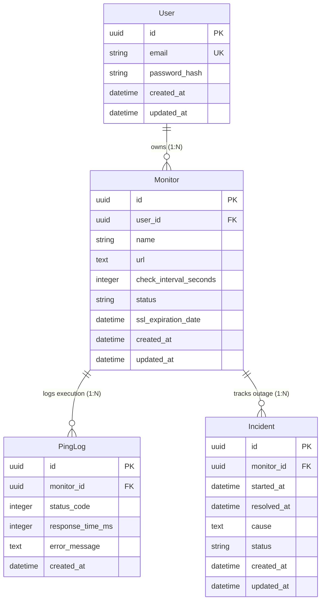

# 🗄️ Database Layer & Domain Models (`internal/db`)

This package manages the relational database persistence, GORM schema definitions, auto-migrations, and transactional domain entity models for **PingGopher**.

---

## 🏛️ Architecture & Database Engine

- **ORM Framework**: [GORM v1.25+](https://gorm.io/)
- **Default Storage (Dev/Local)**: Pure Go CGO-Free SQLite ([`github.com/glebarez/sqlite`](https://github.com/glebarez/sqlite) backed by `modernc.org/sqlite`).
- **Production Storage**: PostgreSQL (fully supported via GORM Postgres driver with zero schema modifications).
- **Primary Keys**: Cryptographically secure 128-bit UUIDs (`github.com/google/uuid`) populated automatically via GORM lifecycle hooks.
- **Relational Integrity**: Foreign Key constraints enabled at connection time via SQLite DSN `_pragma=foreign_keys(1)`.

---

## 📊 Entity-Relationship Diagram (ERD)



---

## 🗂️ Data Dictionary & Schemas

### 1. `users` Table
Stores tenant account credentials and identity metadata.

| Column | Type | Constraints | Description |
| :--- | :--- | :--- | :--- |
| `id` | `uuid` | `PRIMARY KEY` | Unique User UUID |
| `email` | `varchar(255)` | `UNIQUE INDEX`, `NOT NULL` | User email address |
| `password_hash` | `varchar(255)` | `NOT NULL` | Bcrypt hashed password |
| `created_at` | `datetime` | `NOT NULL` | Account creation timestamp |
| `updated_at` | `datetime` | `NOT NULL` | Account modification timestamp |

---

### 2. `monitors` Table
Stores HTTP, Ping, and Synthetic monitoring target configurations.

| Column | Type | Constraints | Description |
| :--- | :--- | :--- | :--- |
| `id` | `uuid` | `PRIMARY KEY` | Unique Monitor UUID |
| `user_id` | `uuid` | `INDEX`, `FK -> users.id` (`CASCADE`) | Target owner ID |
| `name` | `varchar(255)` | `NOT NULL` | Human-readable monitor name |
| `url` | `text` | `NOT NULL` | Target URL (e.g., `https://api.example.com`) |
| `check_interval_seconds` | `integer` | `DEFAULT 60`, `NOT NULL` | Frequency of execution in seconds |
| `status` | `varchar(50)` | `DEFAULT 'PAUSED'`, `NOT NULL` | Operational status: `UP`, `DOWN`, `DEGRADED`, `PAUSED` |
| `ssl_expiration_date` | `datetime` | `INDEX`, `NULLABLE` | Cached SSL certificate expiry date |
| `created_at` | `datetime` | `NOT NULL` | Target creation timestamp |
| `updated_at` | `datetime` | `NOT NULL` | Target modification timestamp |

---

### 3. `ping_logs` Table
Append-only time-series ledger recording probe execution metrics.

| Column | Type | Constraints | Description |
| :--- | :--- | :--- | :--- |
| `id` | `uuid` | `PRIMARY KEY` | Unique Log Entry UUID |
| `monitor_id` | `uuid` | `INDEX`, `FK -> monitors.id` (`CASCADE`) | Associated Monitor ID |
| `status_code` | `integer` | `NOT NULL` | HTTP response code (e.g. 200, 503) |
| `response_time_ms` | `integer` | `NOT NULL` | Probe latency in milliseconds |
| `error_message` | `text` | `NULLABLE` | Network or HTTP error string |
| `created_at` | `datetime` | `INDEX`, `NOT NULL` | Execution timestamp |

---

### 4. `incidents` Table
Tracks downtime events, root causes, and resolution timelines for SLA reporting.

| Column | Type | Constraints | Description |
| :--- | :--- | :--- | :--- |
| `id` | `uuid` | `PRIMARY KEY` | Unique Incident UUID |
| `monitor_id` | `uuid` | `INDEX`, `FK -> monitors.id` (`CASCADE`) | Associated Monitor ID |
| `started_at` | `datetime` | `NOT NULL` | Incident start timestamp |
| `resolved_at` | `datetime` | `NULLABLE` | Incident resolution timestamp |
| `cause` | `text` | `NULLABLE` | Root cause description |
| `status` | `varchar(50)` | `DEFAULT 'OPEN'`, `NOT NULL` | Status: `OPEN`, `INVESTIGATING`, `RESOLVED` |
| `created_at` | `datetime` | `NOT NULL` | Record creation timestamp |
| `updated_at` | `datetime` | `NOT NULL` | Record modification timestamp |

---

## ⚡ Lifecycle Hooks & UUID Auto-Generation

Every struct implements GORM's `BeforeCreate` hook to automatically assign a new UUID if `Nil`:

```go
func (m *Monitor) BeforeCreate(tx *gorm.DB) error {
	if m.ID == uuid.Nil {
		m.ID = uuid.New()
	}
	return nil
}
```

---

## 🧪 Testing & Migrations

### Automated Unit Test Suite (`db_test.go`)

We use an isolated SQLite test database (`test_pinggopher.db`) with automatic teardown (`os.Remove`) to verify schema integrity and relational operations:

| Test Method | Test Focus & Verification |
| :--- | :--- |
| **`TestDatabaseInitializationAndModels`** | - Verifies connection initialization via `InitDB()`.<br>- Tests GORM schema auto-migration across `User`, `Monitor`, `PingLog`, and `Incident`.<br>- Verifies `BeforeCreate` GORM lifecycle hooks auto-generate non-nil UUIDs.<br>- Validates relational foreign key constraints (`ON DELETE CASCADE`).<br>- Verifies nested relational preloading (`Preload("Monitors.PingLogs")` and `Preload("Monitors.Incidents")`). |

### Running Database Unit Tests

```bash
go test -v ./internal/db
```
